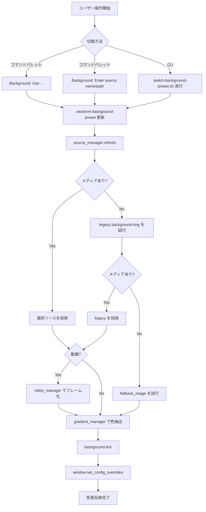

# WezTerm 背景スライドショー 詳細ガイド

## 1. 目的
この設定は、以下を同時に満たすことを目的にしている。

- 画像フォルダからランダムスライドショーを行う
- `mp4` / `mov` を背景動画として再生する
- 文字可読性を保つため、背景にグラデーションレイヤーを重ねる
- 画像ごとに色味を少し適応させる
- WezTerm 起動後に追加した画像も取り込む
- コマンドパレットやスクリプトで背景ソースをすぐ切り替える

## 2. 現在の構成 (分割後)
設定本体は `src/` 配下に集約し、ルートには互換ラッパーのみを置く構成にした。

- `wezterm.lua`
  - 互換エントリ。`src/wezterm.lua` を読み込むだけ
- `keybinds.lua`
  - 互換エントリ。`src/keybinds.lua` を読み込むだけ
- `background.lua`
  - 互換エントリ。`src/background.lua` を読み込むだけ
- `src/wezterm.lua`
  - WezTerm 全体設定の composition root
- `src/wezterm/base_config.lua`
  - フォント/色/ウィンドウ/タブなど静的設定の適用
- `src/wezterm/tab_title.lua`
  - タブタイトル描画イベント (`format-tab-title`)
- `src/wezterm/background_events.lua`
  - 背景切替コマンドパレットと `update-status` イベント
- `src/keybinds.lua`
  - キーバインド関連の集約エントリ
- `src/keybinds/keys.lua`
  - 通常キー割り当て定義
- `src/keybinds/key_tables.lua`
  - key table 定義 (`resize_pane`, `activate_pane`, `copy_mode`)
- `src/background.lua`
  - 背景機能の公開 API と tick 制御本体
- `src/background/utils.lua`
  - clamp/trim/shell_quote など共通ユーティリティ
- `src/background/source_manager.lua`
  - プリセット選択、画像一覧取得、再スキャン、ソース切替
- `src/background/gradient_manager.lua`
  - 画像色抽出と適応グラデーション生成、色変換、キャッシュ
- `src/background/video_manager.lua`
  - `ffmpeg` で動画をフレーム化し、再生用キャッシュを管理
- `src/background/layers.lua`
  - 背景レイヤー構築とイージング
- `scripts/switch-background-preset.sh`
  - CLI からプリセット切替を行う補助スクリプト
- `scripts/configure-background-video.sh`
  - 動画 FPS/画質プリセットを対話形式で変更する補助スクリプト

## 3. 背景フォルダの作り方
`~/.config/wezterm/` 直下に、任意のプリセットディレクトリを作る。

例:

- `preset-1`
- `preset-2`
- `preset-3`

各ディレクトリに `png/jpg/jpeg/mp4/mov` を置く。

補足:

- `mp4/mov` は WezTerm が直接動画描画するのではなく、`ffmpeg` によるフレーム抽出で再生する
- 抽出フレームは `video_cache_dir` に保存され、同じ動画は再利用される

## 4. 実際の使い方

### 4.1 コマンドパレットから切り替える (最も簡単)
1. WezTerm でコマンドパレットを開く
   - 既存設定では `Cmd+P` または `Ctrl+Shift+P`
2. `Background:` で検索する
3. 次のいずれかを実行する
   - `Background: Use preset-1` などの候補を選ぶ
   - `Background: Enter source name or absolute path` で手入力
   - `Background: Force source rescan now` で即時再スキャン

### 4.2 シェルスクリプトで切り替える

```bash
~/.config/wezterm/scripts/switch-background-preset.sh preset-2
```

絶対パスの画像ディレクトリも指定できる。

```bash
~/.config/wezterm/scripts/switch-background-preset.sh /Users/you/Pictures/wallpapers/anime
```

動画も同じ運用で、`preset-*` に `mp4/mov` を置いてそのソースへ切り替えるだけで再生される。

### 4.3 動画のFPS/画質を対話形式で変更する

```bash
~/.config/wezterm/scripts/configure-background-video.sh
```

選択できるプリセット:

- FPS: `30` または `60`
- 画質: `Original` / `1440p` / `1080p` / `720p`

このスクリプトは `~/.config/wezterm/.wezterm-video-settings` を更新する。

### 4.4 セレクタファイルを直接書き換える
内部的には以下ファイルの内容で参照先を決めている。

- `~/.config/wezterm/.wezterm-background-preset`

例:

```bash
printf '%s\n' 'preset-1' > ~/.config/wezterm/.wezterm-background-preset
```

## 5. 反映タイミング

- 通常は `rescan_interval_seconds` 間隔で自動反映
- 即時反映したい場合は:
  - コマンドパレットの `Background: Force source rescan now` を実行
  - もしくは設定再読込 (`Ctrl+Shift+R`)

  ## 6. 動画再生の仕様

  - 動画ファイル (`mp4` / `mov`) が選ばれた場合、先頭フレームから末尾フレームまで順番に表示する
  - 末尾まで再生しきったら、次のメディア (静止画または動画) へ切り替える
  - 動画再生中は、途中でスライドショー間隔による打ち切りは行わない
  - `ffmpeg` が見つからない場合、動画はスキップされる

  ## 7. 調整ポイント
  背景挙動の主要設定は `src/background.lua` の `M.settings` で管理する。

主な項目:

- `slideshow_interval_seconds`
  - 画像切替までの待機秒数
- `rescan_interval_seconds`
  - フォルダ再スキャン間隔
- `tick_interval_ms`
  - 内部更新粒度
- `transition_duration_ms`
  - クロスフェード時間 (有効時)
- `enable_crossfade`
  - `false` なら即時切替
- `image_opacity`
  - 画像レイヤー不透明度
- `enable_video_playback`
  - `mp4/mov` 再生の有効/無効
- `video_extract_fps`
  - 抽出フレームレート
- `video_max_width`
  - 抽出フレーム最大幅 (`-2` で縦横比維持)
- `video_cache_dir`
  - 抽出フレームのキャッシュ先
- `adaptive_gradient`
  - 画像色適応の有効/無効
- `adaptive_tint_strength`
  - 適応色の強さ

## 8. 既定ソースの考え方

- 優先は `preset_selector_file` で指定されたソース
- そのソースにメディアが無ければ `legacy_image_dir` (`background-img`) をフォールバック
- それでもメディアが無ければ `fallback_image` (設定時のみ) を使用

## 9. トラブルシュート

### 9.1 画像/動画を追加したのに変わらない
- 追加先が選択中プリセットと一致しているか確認
- コマンドパレットで `Background: Force source rescan now` を実行

### 9.2 切り替え時にエラーが出る
- 入力したプリセット名/絶対パスのディレクトリ実在を確認
- `scripts/switch-background-preset.sh` を使うと存在チェック付きで設定可能

### 9.3 動画が再生されない
- `ffmpeg` が `PATH` から参照可能か確認
- `video_extract_fps` が極端に高すぎないか確認

### 9.4 色味が強すぎる
- `src/background.lua` の `adaptive_tint_strength` を下げる
- `image_opacity` を下げる

## 10. WezTerm API 的な前提

- 背景は `background` レイヤー合成で実現
- 実行時更新は `update-status` と `window:set_config_overrides(...)` を利用
- 画像色抽出は `wezterm.color.extract_colors_from_image(...)` を利用

CSS ベースのアニメーションは WezTerm の実行モデル上は直接利用できないため、Lua + WezTerm API で制御する方針としている。

## 11. 操作フロー図


